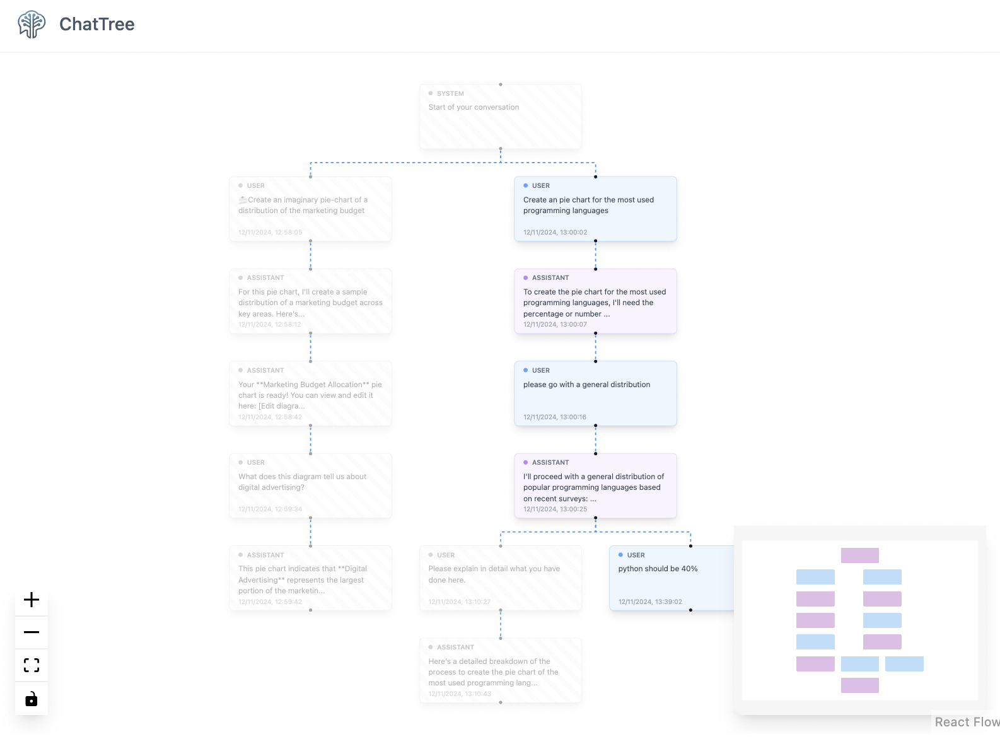

# ChatTree 🌳💬

A Chrome Extension that transforms your ChatGPT conversations into an interactive, visual graph for easier navigation and understanding.


<p align="center">
  
</p>


## Why?

ChatGPT conversations can become complex with multiple branches and responses. It's easy to lose track of different conversation paths and previous contexts. ChatTree solves this by:

- Visualizing your entire conversation as an interactive graph
- Making it easy to switch between different conversation branches
- Providing quick access to edit or respond to any message
- Helping you understand the flow of your conversations

## Features 🚀

- Interactive graph visualization of ChatGPT conversations
- Easy branch switching with visual navigation
- Quick message editing through the UI
- Seamless message addition to any conversation branch
- Real-time conversation tree updates
- Responsive and intuitive design

## Tech Stack

- [React](https://reactjs.org/) - UI Framework
- [Vite](https://vitejs.dev/) - Build Tool
- [Tailwind CSS](https://tailwindcss.com/) - Styling
- [@xyflow/react](https://reactflow.dev/) - Graph Visualization
- [@dagrejs/dagre](https://github.com/dagrejs/dagre) - Graph creation
- [Chrome Extension APIs](https://developer.chrome.com/docs/extensions/reference/)

## Installation 🔧

1. Clone the repository

```
git clone https://github.com/rikardradovac/non-linear-chat
```

2. Install dependencies

```
npm install
```

3. Build the extension
```
npm run build
```


## Usage 📱

1. Load the extension in Chrome:
   - Open `chrome://extensions`
   - Enable "Developer Mode"
   - Click "Load unpacked"
   - Select the `dist` folder

2. Navigate to [chat.openai.com](https://chat.openai.com)
3. Start chatting and use the extension to visualize and navigate your conversations!

## Contributing 🤝

Contributions are welcome! Feel free to submit issues and pull requests.


## 🔐 Security & Privacy

This extension requires the following permissions to function:

- **storage**: To save headers in session in order to fetch the conversations
- **tabs**: To access the current ChatGPT conversation
- **webRequest**: To monitor ChatGPT API requests for conversation data
- **scripting**: To inject the visualization interface
- **activeTab**: To interact with the current ChatGPT tab

This extension requires the `webRequest` permission to:
- Capture authentication headers only from chat.openai.com
- Enable local API calls to fetch conversation history
- Headers are stored securely in your browser's session
- No data is sent to external servers

All data processing happens locally in your browser. No data is sent to external servers.

## License 📄

This project is licensed under the MIT License - see the [LICENSE](LICENSE) file for details.

---

If you find this tool useful, please star the repository! ⭐
